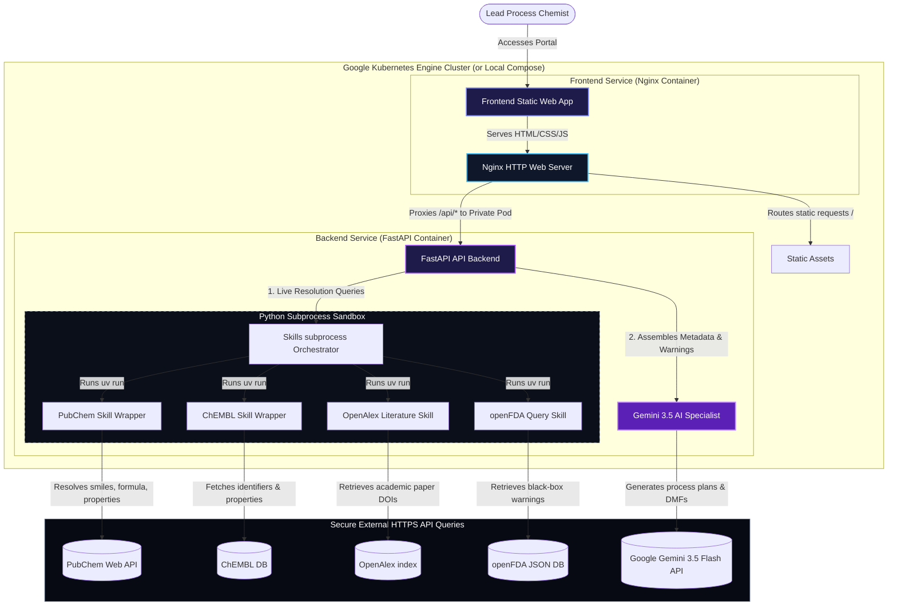

# SynGen: Technical Software Architecture Guide

This document provides a deep-dive technical walkthrough of the software architecture, service orchestrations, data pipelines, and network topology of the **SynGen AI Literature Review & Generic Drug Synthesis Portal**.

---

## 🗺 System Architecture Overview

SynGen is structured as a decoupled, dual-service web application composed of a lightweight static single-page application (SPA) frontend, an asynchronous FastAPI backend gateway, and a subprocess orchestration layer that wraps the **Google DeepMind Science Skills SDK** scripts. The system natively implements a **glowing, zero-padded minimalist Slate theme** and offers full compatibility with local developer servers, Docker Compose, and Google Kubernetes Engine (GKE).

Here is the architectural and network flow of the platform:

---

## 🎨 Architectural Layers

### 1. Frontend Client Layer (`frontend/`)
Served via Nginx in container environments, the client is a highly optimized Single-Page Application (SPA) designed to maintain application states locally in memory:
- **`index.html`**: Contains the dashboard panel structure. Implements a Collapsible Sidebar navigation layout, a right-hand sticky full-height AI Co-Pilot chat panel (`.sidebar-right`), a search-triggered welcome hub, metrics scorecard, timeline accordions, FDA alerts, and a fullscreen preview modal.
- **`style.css`**: Embeds core color tokens (Slate Dark Mode default, adaptive Light Mode variables). Uses CSS Grid to structure dashboard widgets, and styles the right Co-Pilot panel (`.sidebar-right`) to occupy `100vh` viewport height, sticky to the top, with a standard left border, smooth hover transitions, and customized scrollbar tracks.
- **`app.js`**: Binds navigation, theme toggles, and right Co-Pilot chat panels. Triggers interactive `/api/refine` requests, appends chat user/AI bubbles, and refreshes the timeline/dossier components dynamically. Custom-built Markdown-to-HTML compiler (`parseMarkdown`) renders regulatory text without dependencies.

### 2. Backend API Gateway (`backend/`)
Built with FastAPI, the backend acts as a highly structured API gateway that parses requests, delegates subprocesses, and aggregates chemical data:
- **`main.py`**: Declares FastAPI routes:
  - `/`: Standard system check confirming connectivity and Science-Skills SDK path binding.
  - `/api/search`: Live metadata query verifying molecule presence in PubChem and ChEMBL.
  - `/api/synthesis`: Triggers Phase 1 (Live DB query gathering), delegates Phase 2 (Gemini process chemistry reasoning), and maintains Phase 3 (a robust, keyless rule-based process compiler backup).
  - `/api/dmf/generate`: Gathers compound metrics, resolves openFDA warnings, and triggers either custom Gemini CTD drafts or executes a complete, crash-proof Type II DMF document template populated dynamically using Python dictionary `.get()` defaults.
  - `/api/refine`: A POST endpoint that takes the current chemical process steps, active user refinement instructions, and API keys. It runs the query through Gemini 3.5 Flash JSON schema rules or evaluates them using a local regex-based process refiner (adjusting yields, E-factors, flows, safety hazards) to update step structures dynamically.
- **`skills_helper.py`**: Manages Python `subprocess.run` sandbox shells. It dynamically searches the global PATH using `shutil.which` to find `uv` and executes Science Skills scripts inside the `/app/science-skills/` directory efficiently.

### 3. Google DeepMind Science Skills SDK (`science-skills/`)
The DeepMind Science Skills repository is checked out as an isolated dependency. Subprocess scripts are run via `uv run` to guarantee that all dependencies are compiled cleanly on the fly:
- **PubChem wrapper**: Resolves chemical SMILES, structures, CAS values, and GHS safety profiles.
- **ChEMBL wrapper**: Retrieves canonical molecule records, indications, molecular weights, and formulas.
- **OpenAlex wrapper**: Retrieves scholarly publication titles, authorship records, and DOI links for synthesis papers.
- **openFDA query script**: Searches labeling databases for boxed warnings and product NDCs.

---

## 🔒 Security, Configuration, and Fallbacks

### Zero-CORS Network Topology
By routing the frontend static assets and the backend API under a single exposed GKE LoadBalancer port, the Nginx reverse-proxy configuration completely bypasses Browser Cross-Origin Resource Sharing (CORS) complications. Frontend calls to `/api` resolve relative to the current public IP, which Nginx forwards internally over the high-speed K8s cluster network directly to `http://backend-service:8000/api`.

### API Key Decoupling
To avoid hardcoding keys, the backend automatically reads configuration credentials from standard environment variables (`GEMINI_API_KEY`, `OPENALEX_API_KEY`, `FDA_API_KEY`). On local setups, these are loaded from a standard user home `~/.env` file. On Kubernetes, they are securely injected into the deployment pods via Kubernetes Secrets (`syngen-secrets`).

### Zero-API Key Fallback Guarantees
If no API key is provided, the platform remains 100% functional:
1. **Local cache**: If the user searches the pilot compound **Imatinib**, the backend instantly serves cached expert process dossiers and timelines.
2. **Rule-Based Blueprints**: If the user queries a new compound (e.g. *Sildenafil*), the backend retrieves live metadata from PubChem, ChEMBL, openFDA, and OpenAlex, and compiles a highly realistic, dynamic 3-step continuous-flow synthesis route and an ICH-compliant Type II DMF draft immediately without contacting the LLM.
3. **AI Upgrades**: Once a Gemini API key is pasted in the Settings modal, the portal unlocks active LLM process planning and customized regulatory drafting dynamically.
